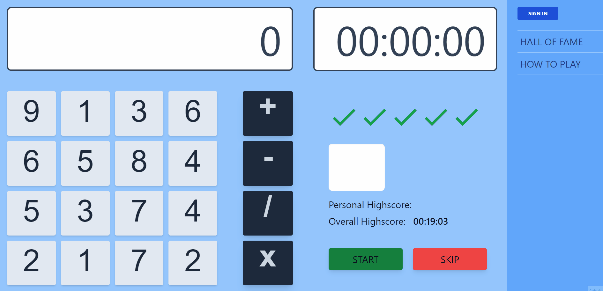

This is a [Next.js](https://nextjs.org/) project bootstrapped with [`create-next-app`](https://github.com/vercel/next.js/tree/canary/packages/create-next-app).

# Juggle Fox
&nbsp;
## Here you get to the [**LIVE APP**](https://juggle-fox.vercel.app//)

## Description!

This is a quick and simple math and reation game. On the lefthand side of the game field you have a calculator with 12 buttons which are randomly populated with 1-digit-numbers.
You can add, subtract, multiply and divide those numbers as with a regular calculator. However, you can only click buttons adjacent to the one you have clicked before and you can only click a button once. Once you've computed the randomly generated number on the righthand side of the game field, one of the five check marks turns green. As soon as all five checkmarks are green, the game is over. Your goal is to complete the game in the least amount of time possible.

## Why I built this app
Developing this project helped me a lot with learning about global state management in a more complex application. It is in this app that I first implemented the useContext hook in connection with the useReducer hook for that purpose. I also learned to use Firebase Authentication and Firebase Firestore for user authentication and performing CRUD operations like storing, updating and retrieving game results.

## Tech Stack
- Javascript ES6
- ReactJS
- NextJS
- Tailwind CSS
- Firebase Authentication
- Firebase Firestore

## Features
- real-time updates of game results
- user registration and login with email and password
- social authentication with Google and Facebook
- top 5 personal results get shown to logged in user
- hall of fame displaying the top 15 players with their best time
- personal record is displayed to logged in users
- overall record is displayed

## How to install and run the project

1) Clone the project, running git **clone https://github.com/Larence0401/JuggleFox.git**

2) Install dependencies running **npm i** in your terminal

## How to use the project

Some ideas for additional feature you could add to the game:

- add sound effects
- build a 3D-version of the game
- change the number of check marks
- change the range 
## Deploy on Vercel

The easiest way to deploy your Next.js app is to use the [Vercel Platform](https://vercel.com/new?utm_medium=default-template&filter=next.js&utm_source=create-next-app&utm_campaign=create-next-app-readme) from the creators of Next.js.

Check out our [Next.js deployment documentation](https://nextjs.org/docs/deployment) for more details.
